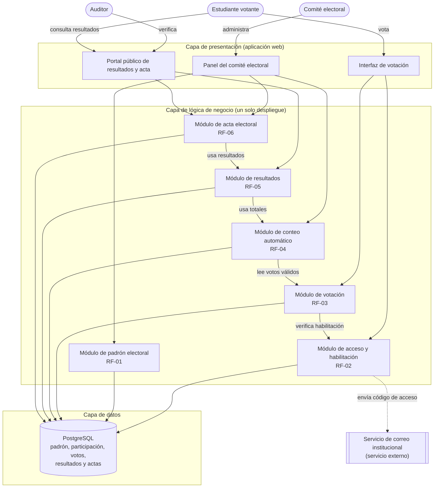

# VotoEPIS - Laboratorio 04: Fundamentos de arquitectura de software
Construcción de Software EPIS-UNSA

## Integrantes
2026-B Grupo B
| Nombre | Rol en el laboratorio |
|---|---|
| Morocco Saico Jose Manuel | Analista de Drivers (E1) y Matriz (E2) |
| Luque Guevara Fernando Gerson | Redactor de ADRs (E4) y Diagramador Mermaid (E3) |
| Hilacondo Begazo Emanuel David | Diagramador PlantUML/Python (E5, E6) |

## Caso
VotoEPIS es un sistema para la elección digital de delegados estudiantiles de la EPIS. Permite gestionar el padrón, emitir votos y publicar resultados auditables. El atributo de calidad crítico es la **Seguridad e integridad (QA-01)**, el cual asegura que el sistema protege el voto, evita alteraciones y rechaza intentos duplicados.

## Arquitectura elegida

## Decisiones arquitectónicas
* [ADR-001: Estilo arquitectónico](docs/architecture/adr/001-estilo-arquitectonico.md)
* [ADR-002: Base de datos](docs/architecture/adr/002-base-de-datos.md)
* [ADR-003: Auditoría y seguridad](docs/architecture/adr/003-auditoria-seguridad.md)

## Reflexión sobre el uso de la IA
El uso de herramientas de IA demostró ser un recurso sumamente valioso para la fase de exploración.
Sin embargo, su uso exige un alto nivel de pensamiento crítico por parte del equipo para evitar sesgos.
La IA tiende a sugerir patrones de diseño avanzados que pueden introducir sobreingeniería en el MVP.
Si estas sugerencias se aceptan sin verificación, ponen en riesgo las restricciones reales del proyecto.
Por ello, la decisión final siempre debe recaer en el juicio humano apoyado en la matriz de decisión.